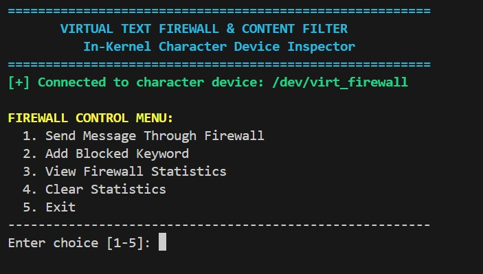
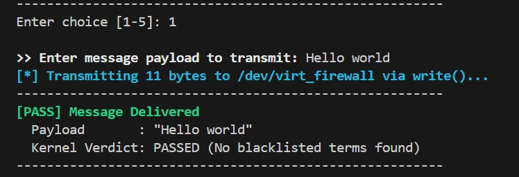
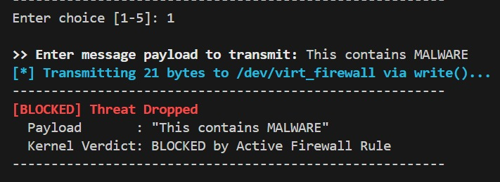
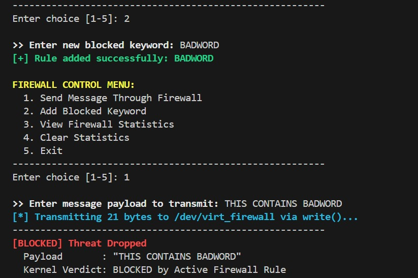
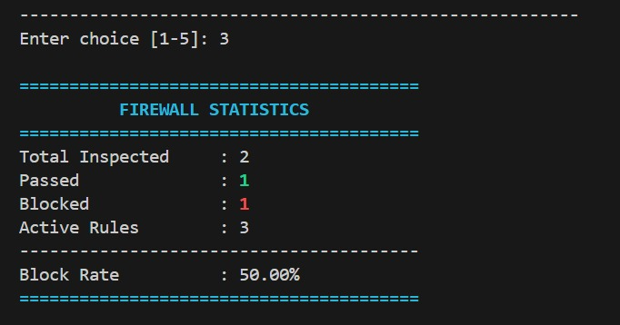

# Virtual Text Firewall & Content Filter

Virtual Text Firewall & Content Filter is a Linux system programming project built using a Linux Character Device Driver in C and a C++17 user-space application.

The C++ application communicates with the kernel through:

```text
/dev/virt_firewall
```

When the user enters a message, it is sent to the Linux kernel driver. The driver checks the message for blocked keywords and returns either `PASS` or `BLOCKED`.

This project demonstrates Linux Device Drivers, System Programming, kernel/user-space communication, POSIX system calls, `ioctl()`, synchronization, and C++ resource management.

---

## 1. Problem Statement

Most text filtering programs work only in user space. They do not show how a normal application can communicate with the Linux kernel through a device driver.

This project solves that learning problem by creating a virtual text firewall.

The C++ application sends text messages to:

```text
/dev/virt_firewall
```

The Linux kernel driver receives the message and checks whether it contains any blocked keyword.

If the message is safe, it is marked as:

```text
PASS
```

If it contains a blocked keyword, it is marked as:

```text
BLOCKED
```

The driver also keeps track of how many messages were checked, passed, and blocked.

This project is made for learning Linux Device Drivers and System Programming. It is not a real network firewall and does not block actual internet traffic.

### Project Scope

The project covers:

- Linux Character Device Driver
- Linux Kernel Module
- User-space and kernel-space communication
- Text filtering inside kernel space
- POSIX system calls
- `ioctl()` operations
- Runtime rule addition
- Firewall statistics
- C++ Object-Oriented Programming
- RAII for file-descriptor handling
- Terminal-based user interface

### Expected Outcome

The final project allows a user to:

1. Load the Linux kernel module.
2. Create and access `/dev/virt_firewall`.
3. Run the C++ application.
4. Send messages through the firewall.
5. See `PASS` or `BLOCKED` results.
6. Add new blocked keywords.
7. View firewall statistics.
8. Reset firewall statistics.
9. Unload the kernel module safely.

---

## 2. Objectives

The main objectives of this project are:

- Create a Linux Character Device Driver in C.
- Create the device `/dev/virt_firewall`.
- Send data between user space and kernel space.
- Use `copy_from_user()` and `copy_to_user()` safely.
- Check text messages inside kernel space.
- Detect blocked keywords.
- Add new blocked keywords while the driver is running.
- Track inspected, passed, and blocked messages.
- Use `ioctl()` for control operations.
- Create an interactive C++17 application.
- Use RAII for file-descriptor management.
- Use synchronization where shared kernel data is accessed.
- Make the project easy to demonstrate and test.

---

## 3. Key Features

### 3.1 Linux Character Device

The kernel module creates:

```text
/dev/virt_firewall
```

The C++ application communicates with this device using Linux system calls.

### 3.2 Kernel-Space Text Filtering

The message is sent from the C++ application using `write()`.

The actual keyword checking happens inside the Linux kernel driver.

### 3.3 Default Blocked Keywords

The driver contains these default blocked keywords:

```text
MALWARE
UNAUTHORIZED
DROP
```

The current implementation uses case-sensitive matching.

For example:

```text
This contains MALWARE
```

will be blocked.

### 3.4 Dynamic Rule Addition

The user can add a new blocked keyword using Menu Option `2`.

The new keyword is sent to the driver using `ioctl()`.

This means the driver does not need to be restarted every time a new rule is added.

### 3.5 PASS / BLOCKED Result

A safe message shows:

```text
[PASS] Message Delivered
```

A message containing a blocked keyword shows:

```text
[BLOCKED] Threat Dropped
```

### 3.6 Firewall Statistics

The driver keeps track of:

- Total messages inspected
- Total messages passed
- Total messages blocked
- Number of active rules

The C++ application also shows the block rate.

### 3.7 Clear Statistics

Menu Option `4` clears the firewall statistics.

The kernel module does not need to be restarted.

### 3.8 Safe Data Transfer

The driver uses:

```c
copy_from_user()
copy_to_user()
```

to safely move data between user space and kernel space.

### 3.9 Atomic Counters and Synchronization

The driver uses atomic counters for firewall statistics.

Shared data such as the rule list is protected using kernel synchronization.

### 3.10 C++ RAII

The C++ application uses a `FirewallManager` class.

The device file is opened when the object is created and closed automatically when the object is destroyed.

This follows the RAII concept in C++.

---

## 4. System Architecture

The project has two main parts:

1. Linux Kernel Driver
2. C++ User-Space Application

### Overall Architecture

```text
+-------------------------------+
|             User              |
+-------------------------------+
                |
                v
+-------------------------------+
|     C++17 Terminal Program    |
|       FirewallManager         |
+-------------------------------+
                |
       open / write / read
             ioctl
                |
                v
+-------------------------------+
|      /dev/virt_firewall       |
+-------------------------------+
                |
                v
+-------------------------------+
|        Linux VFS Layer        |
+-------------------------------+
                |
                v
+-------------------------------+
|   virt_firewall Kernel Driver |
|                               |
|   - Blocked Keywords          |
|   - Text Checking             |
|   - Counters                  |
|   - ioctl Controls            |
|   - Synchronization           |
+-------------------------------+
                |
                v
+-------------------------------+
|       PASS / BLOCKED          |
|         Statistics            |
+-------------------------------+
                |
                v
+-------------------------------+
|       Terminal Output         |
+-------------------------------+
```

### 4.1 Linux Kernel Driver

The driver is implemented in:

```text
driver/virt_firewall.c
```

Its main work is:

- registering the character device
- creating `/dev/virt_firewall`
- handling `open()`
- handling `write()`
- handling `read()`
- handling `unlocked_ioctl()`
- storing blocked keywords
- checking text messages
- updating firewall counters
- sending results back to user space

The Linux `file_operations` structure connects normal file operations such as `read()` and `write()` to the functions inside the driver.

### 4.2 C++ User-Space Application

The C++ application is implemented in:

```text
user_app/main.cpp
```

It provides this menu:

```text
1. Send Message Through Firewall
2. Add Blocked Keyword
3. View Firewall Statistics
4. Clear Statistics
5. Exit
```

The program communicates with `/dev/virt_firewall` using Linux system calls.

A fresh read file descriptor is used when reading driver status. This makes sure repeated reads work correctly.

### 4.3 Message Flow

For example, if the user enters:

```text
This contains MALWARE
```

the flow is:

```text
User enters message
        ↓
C++ application
        ↓
write()
        ↓
/dev/virt_firewall
        ↓
Linux Kernel Driver
        ↓
Message checked against rules
        ↓
MALWARE found
        ↓
Blocked counter updated
        ↓
Driver stores BLOCKED status
        ↓
C++ reads the result
        ↓
[BLOCKED] Threat Dropped
```

### 4.4 Application Interface



The main menu allows the user to send messages, add rules, view statistics, and clear statistics.

---

## 5. Technology Stack

| Technology | Use |
|---|---|
| C | Linux kernel driver |
| C++17 | User-space application |
| Linux | Operating system |
| Linux Kernel Module | Kernel-side implementation |
| Character Device Driver | Communication through `/dev/virt_firewall` |
| POSIX APIs | `open()`, `read()`, `write()`, `close()` |
| ioctl | Driver control operations |
| `copy_from_user()` | Copies data from user space to kernel |
| `copy_to_user()` | Copies data from kernel to user space |
| Atomic Operations | Firewall counters |
| Kernel Mutex | Protects shared data |
| Make / kbuild | Compilation |
| Bash | Load and unload scripts |
| ANSI Escape Codes | Colored terminal output |
| Git / GitHub | Version control and submission |

Recommended environment:

```text
Ubuntu / Debian-based Linux
```

---

## 6. Project Structure

```text
Virtual-Text-Firewall/
│
├── driver/
│   ├── virt_firewall.c
│   ├── virt_firewall_ioctl.h
│   └── Makefile
│
├── user_app/
│   ├── main.cpp
│   └── Makefile
│
├── scripts/
│   ├── load_driver.sh
│   └── unload_driver.sh
│
├── docs/
│   ├── architecture.md
│   └── screenshots/
│       ├── 01-menu.png
│       ├── 02-pass-message.png
│       ├── 03-blocked-message.png
│       ├── 04-statistics.png
│       └── 05-dynamic-rule.png
├── .gitignore
└── README.md
```

### Important Files

#### `driver/virt_firewall.c`

Contains the Linux kernel driver, text filtering logic, blocked rules, and counters.

#### `driver/virt_firewall_ioctl.h`

Contains the shared `ioctl()` commands used by both the kernel driver and C++ application.

#### `driver/Makefile`

Builds the Linux kernel module.

#### `user_app/main.cpp`

Contains the C++ application and `FirewallManager` class.

#### `user_app/Makefile`

Builds the C++ program named:

```text
firewall_ui
```

#### `scripts/load_driver.sh`

Loads the kernel module, checks `/dev/virt_firewall`, sets permissions, and shows kernel messages.

#### `scripts/unload_driver.sh`

Removes the kernel module safely.

#### `docs/architecture.md`

Contains extra information about the project architecture and design.

### Generated Files

The following generated files are not stored in Git:

```text
*.ko
*.o
Module.symvers
modules.order
firewall_ui
```

They are created when the project is compiled.

---

## 7. Applications

This project can be used to learn and demonstrate:

- Linux Device Drivers
- Character Devices
- Linux VFS
- Kernel/User-Space Communication
- POSIX System Programming
- `ioctl()`
- Kernel Memory Transfer
- Runtime Rule Management
- Kernel Synchronization
- Atomic Counters
- C++ OOP
- RAII
- Basic security concepts

This project is a text-filtering simulation and not a real network firewall.

---

## 8. Development Roadmap

The project follows the six stages given for the capstone project.

### Stage 1 – Project Introduction

#### Project Idea

Create a Linux-based Virtual Text Firewall that checks text messages inside kernel space.

#### Objective

Show how a C++ application communicates with a Linux Character Device Driver.

#### Problem

Normal text filters usually work only in user space and do not demonstrate kernel programming.

#### Scope

The project focuses on:

- Linux Character Device Driver
- Kernel text filtering
- User/kernel communication
- Runtime blocked rules
- Firewall statistics
- C++ terminal interface

#### Expected Result

A working system where messages can be sent through `/dev/virt_firewall` and marked as `PASS` or `BLOCKED`.

---

### Stage 2 – Project Requirements & Development Plan

### Functional Requirements

The system should:

1. Create `/dev/virt_firewall`.
2. Accept text from user space.
3. Check text inside kernel space.
4. Detect blocked keywords.
5. Return PASS or BLOCKED.
6. Track inspected messages.
7. Track passed messages.
8. Track blocked messages.
9. Add new blocked keywords.
10. Clear statistics.
11. Provide a C++ terminal menu.
12. Load and unload the driver safely.

### Non-Functional Requirements

The system should:

- handle memory safely
- avoid buffer overflow
- validate input size
- provide clear terminal messages
- keep the kernel stable
- use standard Linux development tools
- keep kernel and user-space code separate
- be easy to compile and demonstrate

### Project Modules

```text
Linux Kernel Driver
C++ Application
ioctl Interface
Build System
Load / Unload Scripts
Documentation
```

### Deliverables

The final project includes:

- Linux driver source code
- C++ source code
- shared ioctl header
- Makefiles
- Bash scripts
- architecture documentation
- README
- GitHub repository

### Development Flow

```text
Requirements
    ↓
Design
    ↓
Driver Development
    ↓
C++ Application
    ↓
Integration
    ↓
Testing
    ↓
Documentation
    ↓
Final Submission
```

---

### Stage 3 – System Design & Architecture

The project is divided into kernel-space and user-space parts.

### Main Components

| Component | Work |
|---|---|
| Character Device Driver | Handles kernel-side device operations |
| Rule List | Stores blocked keywords |
| Filtering Logic | Checks messages |
| Counters | Tracks firewall activity |
| ioctl Interface | Handles control commands |
| FirewallManager | C++ device management |
| Terminal UI | User interaction |

### Main Data

The driver stores:

- blocked keywords
- number of active rules
- last inspection result
- total inspected count
- total passed count
- total blocked count

### Class Diagram

```text
+--------------------------------+
|        FirewallManager         |
+--------------------------------+
| - fd                           |
| - devicePath                   |
+--------------------------------+
| + sendMessage()                |
| + addBlockedWord()             |
| + showStatistics()             |
| + clearStatistics()            |
| + fetchDriverState()           |
+--------------------------------+
```

### Sequence Diagram

```text
User
 |
 | enters message
 v
C++ Application
 |
 | write()
 v
/dev/virt_firewall
 |
 v
Kernel Driver
 |
 | copy_from_user()
 | check keywords
 | update counters
 | save result
 v
Driver State
 |
 | read()
 v
C++ Application
 |
 v
PASS / BLOCKED
```

### State Diagram

```text
              +-------------+
Message ----> |   INSPECT   |
              +-------------+
                /         \
               /           \
           safe             blocked
             |                 |
             v                 v
         +-------+        +---------+
         | PASS  |        | BLOCKED |
         +-------+        +---------+
```

### Development Environment

The project uses:

```text
Linux
GCC
G++
Make
Linux Kernel Build System
Git
GitHub
Terminal
```

---

### Stage 4 – Initial Implementation & Prototype

The first working version focused on communication between the C++ application and the Linux Character Device Driver.

The first implementation included:

- character-device registration
- `/dev/virt_firewall`
- `open()` and `release()`
- `write()` support
- keyword checking
- safe data transfer
- basic C++ communication
- PASS/BLOCKED output

The kernel driver and C++ program were then connected step by step.

During testing, repeated device reads were also checked.

A problem was found where the same file descriptor reached EOF after one read.

The C++ application was updated to open a fresh read descriptor each time the driver status is read.

---

### Stage 5 – Testing, Integration & Improvement

The complete system was tested after connecting the kernel driver and C++ application.

### Test 1 – Safe Message

Input:

```text
Hello world
```

Expected:

```text
[PASS] Message Delivered
```

Result:

```text
PASS
```

### Test 2 – Blocked Message

Input:

```text
This contains MALWARE
```

Expected:

```text
[BLOCKED] Threat Dropped
```

Result:

```text
BLOCKED
```

### Test 3 – Add New Rule

A new blocked keyword such as:

```text
BADWORD
```

can be added using Menu Option `2`.

After adding the rule, any message containing `BADWORD` should be blocked.

### Test 4 – View Statistics

Menu Option `3` displays firewall statistics.

### Test 5 – Clear Statistics

Menu Option `4` resets the counters.

### Test 6 – Load Driver

The kernel module is loaded and `/dev/virt_firewall` is checked.

### Test 7 – Unload Driver

The unload script removes the kernel module and checks that the device is removed.

### Issue Found During Testing

One issue was found during repeated reads.

After the first read, the device file offset reached EOF. This caused later status reads to return no data.

The issue was fixed by opening a fresh read file descriptor every time the C++ application reads the driver status.

---

### Stage 6 – Final Implementation & Presentation

The final project includes:

- Linux Character Device Driver
- `/dev/virt_firewall`
- Kernel text filtering
- Default blocked keywords
- Runtime rule addition
- PASS/BLOCKED output
- Firewall statistics
- Statistics reset
- C++ terminal application
- Driver load/unload scripts
- Architecture documentation
- GitHub-ready folder structure

The full project development flow is:

```text
Requirements
→ Design
→ Implementation
→ Integration
→ Testing
→ Documentation
→ Final Submission
```

---

## 9. Expected Output

### Main Menu


The application shows the firewall menu after successfully connecting to `/dev/virt_firewall`.

### Safe Message

Input:

```text
Hello world
```

Expected output:

```text
[PASS] Message Delivered
Payload       : "Hello world"
Kernel Verdict: PASSED (No blacklisted terms found)
```



The message passes because it does not contain any blocked keyword.

### Blocked Message

Input:

```text
This contains MALWARE
```

Expected output:

```text
[BLOCKED] Threat Dropped
Payload       : "This contains MALWARE"
Kernel Verdict: BLOCKED by Active Firewall Rule
```



The message is blocked because `MALWARE` is an active firewall rule.
### Dynamic Rule Addition

A new blocked keyword can be added while the firewall is running using Menu Option `2`.

Example:

```text
BADWORD
```

After adding the new rule, the message:

```text
THIS CONTAINS BADWORD
```

is blocked by the kernel driver without restarting the module.



This shows that the firewall rule list can be updated during runtime.
### Firewall Statistics

Menu Option `3` displays information such as:

```text
Total Inspected
Passed
Blocked
Active Rules
Block Rate
```



---

## 10. Quick Start for Trainer / Evaluator

This section gives the shortest steps to run and test the project.

### Recommended Environment

Ubuntu or another Debian-based Linux system with matching kernel headers.

### Step 1 – Clone the Repository

```bash
git clone https://github.com/IshaMohini/Virtual-Text-Firewall.git
cd Virtual-Text-Firewall
```


### Step 2 – Install Required Packages

```bash
sudo apt update
sudo apt install -y build-essential linux-headers-$(uname -r)
```

### Step 3 – Build the Kernel Driver

```bash
cd driver
make
```

A successful build creates:

```text
virt_firewall.ko
```

### Step 4 – Build the C++ Application

```bash
cd ../user_app
make
```

A successful build creates:

```text
firewall_ui
```

### Step 5 – Load the Driver

Return to the project root:

```bash
cd ..
chmod +x scripts/*.sh
./scripts/load_driver.sh
```

The script:

- loads `virt_firewall.ko`
- checks `/dev/virt_firewall`
- sets device permissions
- shows kernel messages

### Step 6 – Run the Application

```bash
cd user_app
./firewall_ui
```

### Quick Verification

#### Test 1 – Safe Message

Choose:

```text
1
```

Enter:

```text
Hello world
```

Expected:

```text
[PASS] Message Delivered
```

#### Test 2 – Blocked Message

Choose Option `1`.

Enter:

```text
This contains MALWARE
```

Expected:

```text
[BLOCKED] Threat Dropped
```

#### Test 3 – Add New Rule

Choose:

```text
2
```

Enter:

```text
BADWORD
```

#### Test 4 – Test New Rule

Choose Option `1`.

Enter:

```text
This contains BADWORD
```

Expected:

```text
[BLOCKED] Threat Dropped
```

#### Test 5 – View Statistics

Choose:

```text
3
```

#### Test 6 – Clear Statistics

Choose:

```text
4
```

### Unload the Driver

After testing:

```bash
cd ..
./scripts/unload_driver.sh
```

### Important Kernel Module Note

The generated file:

```text
virt_firewall.ko
```

should be built on the Linux system where it will be used.

Linux kernel modules depend on the running kernel version.

The evaluator should therefore run:

```bash
cd driver
make
```

before loading the module.

This helps avoid errors such as:

```text
Invalid module format
```

---

## 11. Future Enhancements

Future improvements can include:

- removing blocked keywords at runtime
- case-insensitive keyword checking
- saving custom rules permanently
- different rule levels
- timestamps for firewall events
- blocked-message history
- better support for multiple users
- improved concurrency handling
- graphical user interface
- web-based dashboard
- user-space logging service
- integration with Linux Netfilter for real network packet filtering

These features are not part of the current version.

---

## 12. Conclusion

The Virtual Text Firewall & Content Filter shows how a C++ user-space program can communicate with a Linux kernel module through a Character Device Driver.

The project demonstrates:

- Linux Device Drivers
- Character Devices
- Kernel/User-Space Communication
- `copy_from_user()`
- `copy_to_user()`
- `ioctl()`
- Atomic Counters
- Synchronization
- POSIX System Calls
- C++ OOP
- RAII

The project also follows the complete software development process:

```text
Requirements
→ Design
→ Implementation
→ Testing
→ Documentation
→ Final Delivery
```

It provides practical experience in Linux System Programming and C++ while applying these concepts to a simple security-based application.

---

## 13. Author

Isha Mohini  
B.Tech Computer Science & Engineering  
Siksha 'O' Anusandhan (SOA) University  
7th Semester  

## 14. License

The Linux kernel module uses GPL v2 compatible licensing.

The license information is defined in the kernel module source code.

If a separate `LICENSE` file is added to the GitHub repository, it should use the same license as the source code.