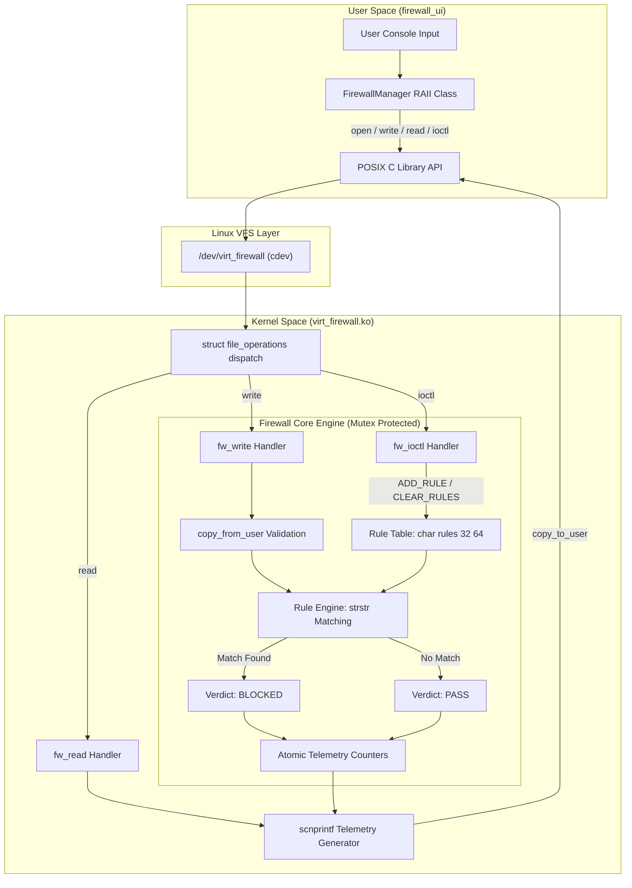

# Virtual Text Firewall & Content Filter — System Architecture

## 1. Overview and High-Level Architecture

The **Virtual Text Firewall & Content Filter** is a modular Linux system engineering project designed to demonstrate kernel-space text payload inspection and user-space to kernel-space IPC via character device drivers.

The fundamental architectural principle is strict separation of concerns:
- **User Space (`user_app`)**: Provides a menu-driven, interactive terminal user interface (C++17) using standard POSIX system calls (`open`, `write`, `read`, `ioctl`, `close`) and modern C++ Resource Acquisition Is Initialization (RAII).
- **VFS Layer (`/dev/virt_firewall`)**: Exposes a standard character device node registered under the Linux Virtual Filesystem.
- **Kernel Space (`virt_firewall.ko`)**: Implements character device registration, safely copies user payloads across the virtual memory boundary, executes substring matching against an in-memory rule table, maintains atomic telemetry counters, and handles dynamic control commands via `ioctl()`.

```
+-------------------------------------------------------------------+
|                        USER SPACE (C++17)                         |
|                                                                   |
|   +-----------------------------------------------------------+   |
|   |                      Terminal Menu UI                     |   |
|   +-----------------------------------------------------------+   |
|                                 |                                 |
|   +-----------------------------------------------------------+   |
|   |         FirewallManager (C++ RAII Device Handler)         |   |
|   +-----------------------------------------------------------+   |
+---------------------------------|---------------------------------+
                                  | POSIX System Calls
                                  | (open, write, read, ioctl, close)
+---------------------------------v---------------------------------+
|                       VFS / SYSTEM CALL LAYER                     |
|                                                                   |
|                    /dev/virt_firewall (Major/Minor)               |
+---------------------------------|---------------------------------+
                                  | struct file_operations
+---------------------------------v---------------------------------+
|                       KERNEL SPACE (C Driver)                     |
|                                                                   |
|   +-----------------------------------------------------------+   |
|   |                   virt_firewall Driver Core               |   |
|   |                                                           |   |
|   |   +------------------+  +------------------+  +-------+   |   |
|   |   | In-Memory Rules  |  |  Text Filtering  |  |Atomic |   |   |
|   |   | (Bounded Array)  |  |  (strstr Search) |  |Stats  |   |   |
|   |   +------------------+  +------------------+  +-------+   |   |
|   |            ^                      ^               ^       |   |
|   |            |                      |               |       |   |
|   |     ioctl(ADD_RULE)         write(kbuf)      read(stats)  |   |
|   +-----------------------------------------------------------+   |
+-------------------------------------------------------------------+
```

---

## 2. Mermaid Architecture Diagram



---

## 3. Subsystem Breakdown

### 3.1 Device Node Registration & Lifecycle
- **Dynamic Allocation**: `alloc_chrdev_region()` allocates an available major number and minor number (0) at runtime.
- **cdev Binding**: `cdev_init()` binds the driver's `struct file_operations` dispatch table (`open`, `release`, `read`, `write`, `unlocked_ioctl`) to `struct cdev`, which is registered via `cdev_add()`.
- **sysfs & Device Node Creation**: `class_create()` creates `/sys/class/virt_firewall_class`. `device_create()` then creates the node at `/dev/virt_firewall`.
- **Modern Kernel Compatibility**:
  ```c
  #if LINUX_VERSION_CODE >= KERNEL_VERSION(6, 4, 0)
      fw_class = class_create(VIRT_FW_CLASS_NAME);
  #else
      fw_class = class_create(THIS_MODULE, VIRT_FW_CLASS_NAME);
  #endif
  ```
  This conditional macro accounts for the Linux 6.4 API change where `THIS_MODULE` was removed from `class_create()`.

### 3.2 In-Kernel Rule Storage & Concurrency Control
- **Rule Storage**: A static 2D array in BSS:
  ```c
  static char fw_rules[MAX_RULES][MAX_KEYWORD_LENGTH];
  static unsigned int fw_rule_count = 0;
  ```
  This eliminates kernel dynamic memory allocation (`kmalloc`), avoiding memory leaks and fragmentation.
- **Default Blacklist**: `"MALWARE"`, `"UNAUTHORIZED"`, `"DROP"`.
- **Synchronization**: `fw_mutex` (`struct mutex`) serializes concurrent access when inspecting text or altering rules via `ioctl()`.
- **Atomic Telemetry**: `atomic64_t total_inspected`, `total_passed`, `total_blocked` guarantee atomic lock-free increments across multiple threads or processor cores.

---

## 4. Sequence Diagrams

### 4.1 Message Inspection Sequence (`write()` followed by `read()`)

```mermaid
sequenceDiagram
    autonumbe
    actor Use
    participant App as C++ FirewallManage
    participant VFS as /dev/virt_firewall
    participant Driver as virt_firewall (Kernel)
    participant Rules as Rule Engine & Counters

    User->>App: 1. Send Message ("Hello MALWARE attack")
    App->>VFS: write(fd, buffer, length)
    VFS->>Driver: fw_write(filp, user_buf, count, offset)
    Driver->>Driver: copy_from_user(kbuf, user_buf, count)
    Driver->>Rules: atomic64_inc(total_inspected)
    Driver->>Rules: mutex_lock(fw_mutex)
    Driver->>Rules: Iterate rules: strstr("Hello MALWARE attack", "MALWARE")
    Rules-->>Driver: Match Found!
    Driver->>Rules: atomic64_inc(total_blocked)
    Driver->>Rules: last_verdict = BLOCKED
    Driver->>Rules: mutex_unlock(fw_mutex)
    Driver-->>VFS: Return count (bytes written)
    VFS-->>App: write() returns count

    App->>VFS: read(fd, buffer, size)
    VFS->>Driver: fw_read(filp, user_buf, count, offset)
    Driver->>Driver: scnprintf(STATUS=BLOCKED\nTOTAL_INSPECTED=...)
    Driver->>App: copy_to_user(user_buf, out_buf, count)
    App->>App: Parse KEY=VALUE string
    App-->>User: Display [BLOCKED] Threat Dropped (Red ANSI)
```

### 4.2 Dynamic Rule Insertion Sequence (`ioctl(ADD_RULE)`)

```mermaid
sequenceDiagram
    autonumbe
    actor Admin as User / Admin
    participant App as C++ FirewallManage
    participant VFS as /dev/virt_firewall
    participant Driver as virt_firewall (Kernel)

    Admin->>App: 2. Add Rule ("TROJAN")
    App->>VFS: ioctl(fd, VIRT_FW_IOC_ADD_RULE, "TROJAN")
    VFS->>Driver: fw_ioctl(filp, cmd, arg)
    Driver->>Driver: copy_from_user(kw_buf, arg, sizeof(kw_buf))
    Driver->>Driver: Validate length & null termination
    Driver->>Driver: mutex_lock(fw_mutex)
    Driver->>Driver: Check rule_count < MAX_RULES
    Driver->>Driver: Check duplicate (strcmp)
    Driver->>Driver: strscpy(rules[rule_count++], "TROJAN")
    Driver->>Driver: mutex_unlock(fw_mutex)
    Driver-->>VFS: return 0 (Success)
    VFS-->>App: ioctl returns 0
    App-->>Admin: Display: [+] Rule added successfully: TROJAN
```

---

## 5. Security & Safety Guarantees

1. **User Pointer Isolation**: User pointers are never directly dereferenced. All transfers go through `copy_from_user()` and `copy_to_user()`.
2. **Buffer Overflow Prevention**:
   - `kbuf` length is strictly clamped to `MAX_MESSAGE_LENGTH`.
   - Explicit null-termination is applied after every copy.
   - String functions use safe kernel variants: `strscpy()` instead of `strcpy()`, `scnprintf()` instead of `sprintf()`.
3. **No Dynamic Memory Leaks**: Rules are maintained in bounded static memory buffers (`MAX_RULES = 32`, `MAX_KEYWORD_LENGTH = 64`), eliminating heap allocation failure vectors.
4. **POSIX File Offset Handling**: `fw_read()` respects `*offset` and outputs an EOF (0 bytes) after serving the telemetry payload once, preventing infinite read loops when probed with utilities like `cat`.
